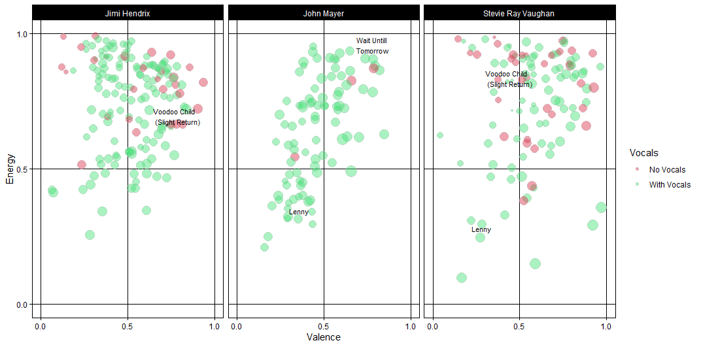
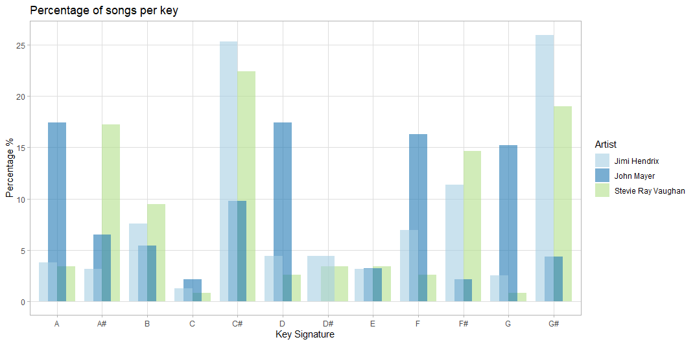
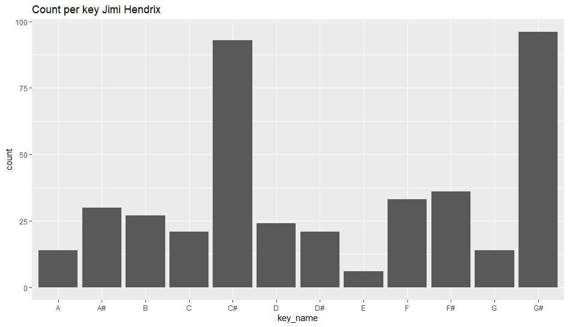
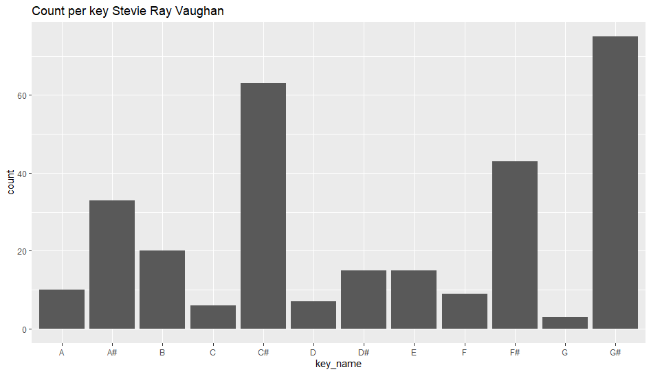
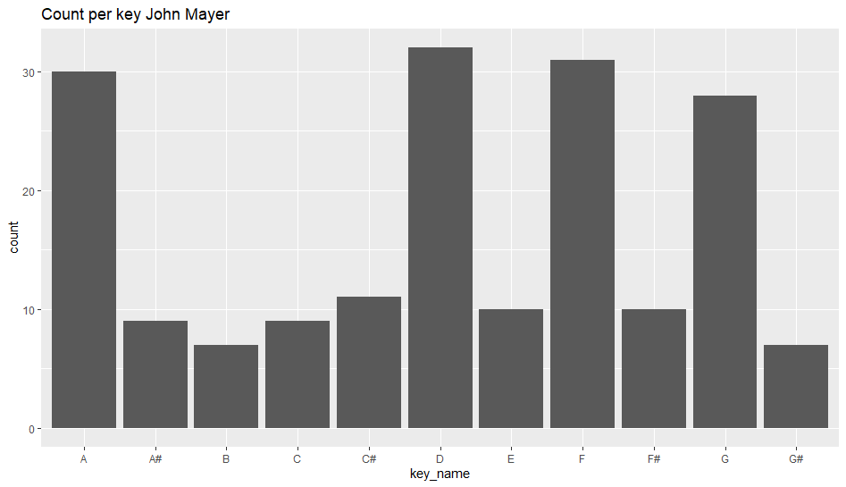

## Computational Musicology 
##### By: Bart de Rooij
##### Student Number: 11883138

## Week 2
This week I tried visualizing some more data. I decided to use valence and energy to use as data because both of these features combine different features of spotify into one variable.   
In addition, the size of each data point is decided by the danceability and a colour is added to signal if a track is only instrumental.   
Since last week I changed my corpus. The playlists now contain only live performances of the artist to better compare their styles. Over the coming week I want to investigate the corpus a little more to ensure this is the most representable corpus.

## Week 1
### Comparing "Jimi Hendrix Copy Cats"
A lot of the times people compare guitarists to what they deem the greatest guitarist of all time and often this guitarist is Jimi Hendrix. Hendrix was an innovative guitarist who changed the musical landscape forever with his unique style of playing. With such a huge legacy and influence it is no surprise that people wanted to emulate his style.  
Sometimes this emulating goes a bit far and people accuse others of actually copying Hendrix' style. For this project I wanted to take a closer look at some of these so-called "copy cats" to see if these statements have some truth to them. I have chosen to examine Stevie Ray Vaughan and John Mayer as they often get compared to Jimi Hendrix.    

##### Main Question
The main question for this project will be:  
*How similar are "copy cats of Jimi Hendrix" (such as Stevie Ray Vaughan and John Mayer) to Jimi Hendrix himself?*

##### Dataset
For the first dataset the "This is X" playlists by Spotify were used. These playlists give an overall idea of what music an artist makes. These playlists are as described by Spotify "the essential tracks, all in one playlist". Because of this, it can be concluded that these playlists encompass the style of the artist. These lists contain approximately 50-60 songs of the artist which makes it a good data set with respect to size. 

##### First findings
By summarizing the data we can already interpret some of the data. Because Jimi Hendrix was mainly known for his guitar playing, the instrumentalism feature is a good starting point. Tempo and energy were also examined because the three of these together are the essentials for Hendrix' playing style. Down below the mean, standard deviation, maximum and minimum values for these three features can be seen for the three artist. It also contains a plot with the counts of songs in each key for every artist. This was done with the get_artist_audio_features function by Spotifyr. As can be seen, Jimi Hendrix and Stevie Ray Vaughan have very similar feature data and key centers and John Mayer is not quite the same. We also see that there are some outliers with respect to tempo and instrumentalism because they are 0. These tracks need to be filtered out because they are probably not measured correctly.    
It would be interesting to use live recordings of the artists because this is where the playing styles could be compared even better. Especially with John Mayer, the tracks are sometimes not very representative for the artist's playing style. I suspect that with live performances the character and influences of someones playing are captured better than on studio recordings. It will be interesting to investigate these suspicions in the coming weeks. 

###### Jimi Hendrix features

|                 | Mean      | Standard Deviation | Maximum | Minimum |
|-----------------|-----------|--------------------|---------|---------|
| Instrumentalism | 0.2077483 | 0.276285           | 0.938   | 0       |
| Tempo           | 120.7844  | 30.33633           | 204.671 | 0       |
| Energy          | 0.7359451 | 0.1840287          | 0.992   | 0.0473  |

###### Stevie Ray Vaughan features

|                 | Mean      | Standard Deviation | Maximum | Minimum |
|-----------------|-----------|--------------------|---------|---------|
| Instrumentalism | 0.2916942 | 0.3131774          | 0.975   | 0       |
| Tempo           | 125.6122  | 27.11775           | 187.852 | 48.172  |
| Energy          | 0.6705746 | 0.2272377          | 0.981   | 0.0376  |

###### John Mayer features

|                 | Mean       | Standard Deviation | Maximum | Minimum |
|-----------------|------------|--------------------|---------|---------|
| Instrumentalism | 0.05719752 | 0.1656013          | 0.935   | 0       |
| Tempo           | 117.9368   | 27.84372           | 183.345 | 0       |
| Energy          | 0.5887913  | 0.2080062          | 0.936   | 0.0695  |

 
