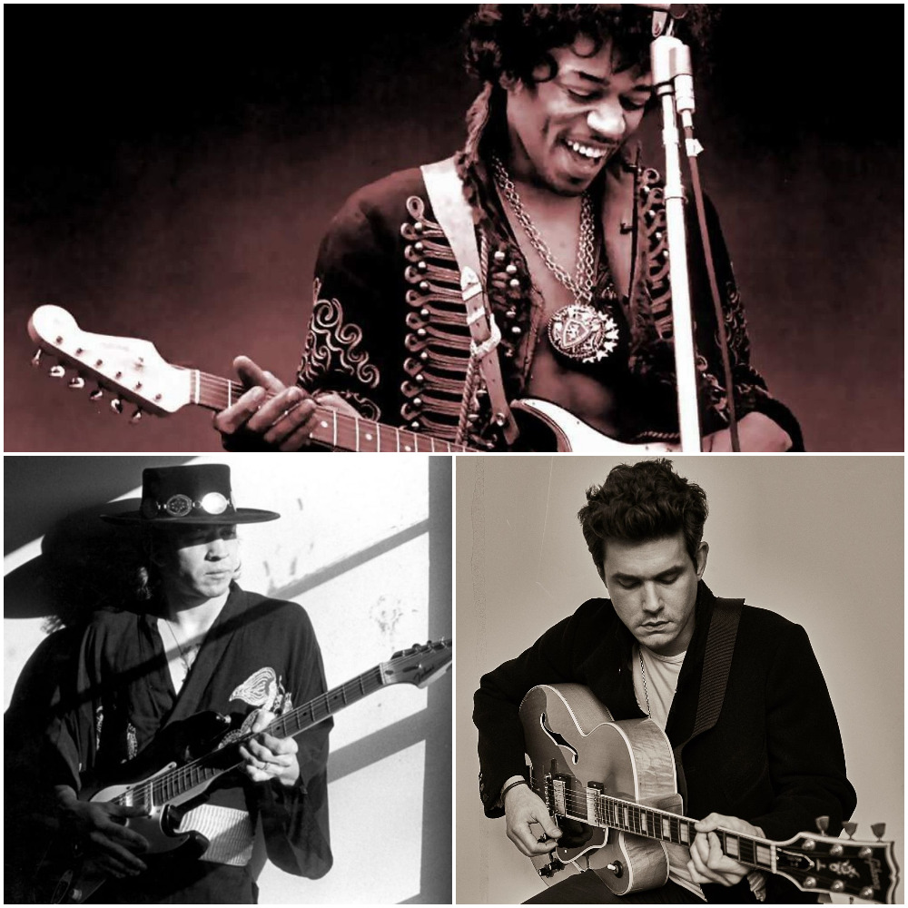

Introduction
=============================================================================================

```{r setup}
# Packages used in this project. 
library(tidyverse)
library(ggplot2)
library(spotifyr)
library(flexdashboard)
library(compmus)
library(tidymodels)
library(protoclust)
library(ggdendro)
library(heatmaply)
library(grid)
library(gridExtra)
```

```{r echo = FALSE}
# Set Spotify access variables (every time)
Sys.setenv(SPOTIFY_CLIENT_ID = '29b7536b5f6f4f21a1e9075195a34105')
Sys.setenv(SPOTIFY_CLIENT_SECRET = 'e5d4ec6492a44dbf808852fb35d36923')
```

Column {data-width=400}
------------------------------------------------------------------------------------------------
### Introduction: Musical Copycats 
<h1> What is this project about? </h1>
A lot of the times people compare guitarists to what they deem the greatest guitarist of all time. Often times this guitarist is Jimi Hendrix. Hendrix was an innovative guitarist who changed the musical landscape forever with his unique style of playing. With such a huge legacy and influence it is no surprise that people wanted to emulate his style. <br>
Sometimes this emulating goes a bit far and people accuse others of actually copying Hendrix' style. For this project I wanted to take a closer look at some of these so-called "copy cats" to see if these statements have some truth to them. I have chosen to examine Stevie Ray Vaughan and John Mayer as they often get compared to Jimi Hendrix. I will try to find out if there are some parallels between the three playing styles and if they are explainable with the Spotify API data. <br> <br>

The main question for this project will be: <br>
*How similar are "copy cats of Jimi Hendrix" (such as Stevie Ray Vaughan and John Mayer) to Jimi Hendrix himself?* <br><br>

To research this, a representable corpus of the three artist is comprised which encompasses each of the artist playing style. With this corpus, using track level features and audio analysis, a comparision will be made. One note, which is obvious but necessary to make, is that these three artist all performed in three different eras. This means that Stevie Ray Vaughan could be only be influenced by Jimi Hendrix and John Mayer could be influenced by both Hendrix and Stevie Ray Vaughan. <br><br>

I predict that Stevie Ray Vaughan shows a lot of similarities with Jimi Hendrix because their styles seem to be comparable. John Mayer will show more similarities to Stevie Ray Vaughan than Jimi Hendrix because his style is heavily influenced by SRV (which he has admitted in the past).

The following packages are used in this project. <br><br>

```{r, eval=FALSE, echo=TRUE}
# Packages used in this project. 
library(tidyverse)
library(ggplot2)
library(spotifyr)
library(flexdashboard)
library(compmus)
library(tidymodels)
library(protoclust)
library(ggdendro)
library(heatmaply)
```


Column {data-width=600}
------------------------------------------------------------------------------------------------
### Jimi Hendrix, Stevie Ray Vaughan and John Mayer



Data
==============================================================================================

Column {data-width=750}
-----------------------------------------------------------------------------------------------

### Used Data
To compare these different artist and their playing style, studio recordings and live performances were gathered and put into spotify playlists. Each playlist consists of 100 songs/performances of the artist. These playlist represent the artist live perfomance playing styles as well as studio recordings over their careers which should be sufficient to compare the artist to eachother. One thing to note is that some of the live performances by Jimi Hendrix and Stevie Ray Vaughan are not the same quality as studio recordings by them. This is not the case with John Mayer where the live recordings are almost the same quality as studio recordings. This may cause problems for some audio analyses because we are comparing recordings of different quality and EQs which give very different characteristics to the sound. One could argue that this is also part of the guitarist style because it seems to be consistent throughout every artist playlist. At the bottom of this page, the three playlists that are used can be seen. All songs which were just talking on albums or tracks that were not suitable are removed. <br><br>

Usings the data available by Spotify, plots and representation are made. These audio features consist of basic features such as key, mode, acousitcness, danceability, energy, instrumentalness, liveness, loudness, speechiness, valence, tempo as well as more complex audio analysis for bars, segments, beats and sections. <br> <br>

Because we are interested in comparing style of the three artists, we need a combinations of track level features and audio analyses of tracks to get a complete understanding of the artist playing style. It may be the case that the combination of all this data still does not capture the subtleness of each players playing style. This is because the artist are likely not copying each other on a one-to-one scale. <br> <br>

In the table below some track level features are displayed per playlist. It can be seen that Jimi Hendrix and Stevie Ray Vaughan have a higher instrumentalness overall than John Mayer which means that there are more strictly instrumentall tracks in these playlists. It can also be seen that Hendrix has the highest energy, followed by Stevie Ray Vaughan and finally John Mayer. This can be explained by the fact that a lot of Mayers songs are less intense and more mellow than the high energy playing styles of Jimi Hendrix and the Texas blues by Stevie Ray Vaughan. <br><br>

| Jimi Hendrix | Mean      | Standard Deviation |                 | Stevie Ray Vaughan  | Mean      | Standard Deviation |                  | John Mayer| Mean       | Standard Deviation |
|-----------------|-----------|--------------------|-----------------|-----------------|-----------|--------------------|-----------------|-----------------|------------|--------------------|
| Instrumentalism | 0.2077483 | 0.276285           |                 | Instrumentalism | 0.2916942 | 0.3131774          |                 | Instrumentalism | 0.05719752 | 0.1656013          |
| Tempo           | 120.7844  | 30.33633           |                 | Tempo           | 125.6122  | 27.11775           |                 | Tempo           | 117.9368   | 27.84372           |
| Energy          | 0.7359451 | 0.1840287          |                 | Energy          | 0.6705746 | 0.2272377          |                 | Energy          | 0.5887913  | 0.2080062          |


<br> <br>

<iframe src="https://open.spotify.com/embed/playlist/6XJ7cPe4XJTu4debuDld7R" width="300" height="380" frameborder="0" allowtransparency="true" allow="encrypted-media"></iframe>

<iframe src="https://open.spotify.com/embed/playlist/4q24CEb8kFE6HadhZSXinh" width="300" height="380" frameborder="0" allowtransparency="true" allow="encrypted-media"></iframe>

<iframe src="https://open.spotify.com/embed/playlist/6e36IvL6S5cESz1yNTQRqa" width="300" height="380" frameborder="0" allowtransparency="true" allow="encrypted-media"></iframe>

Column {data-width=250}
--------------------------------------------------------------------------------------------------

```{r}
hendrix <- get_playlist_audio_features('bartderooij2009', '6XJ7cPe4XJTu4debuDld7R')
srv <- get_playlist_audio_features('bartderooij2009', '4q24CEb8kFE6HadhZSXinh')
mayer <- get_playlist_audio_features('bartderooij2009', '6e36IvL6S5cESz1yNTQRqa')

all_songs <-
  hendrix %>% mutate(playlist = "Jimi Hendrix") %>%
  bind_rows(srv %>% mutate(playlist = "Stevie Ray Vaughan")) %>%
  bind_rows(mayer %>% mutate(playlist = "John Mayer"))
```

### Jimi Hendrix

<div>
```{r}
valueBox(value=11,
         caption='different albums by Jimi Hendrix',
         icon = "fa-compact-disc")
```
</div>


### Stevie Ray Vaughan

<div>
```{r}
valueBox(value=11,
         caption = "different albums by Stevie Ray Vaughan",
         icon = "fa-compact-disc")
```
</div>


### John Mayer

<div>
```{r}
valueBox(value=8,
         caption="different albums by John Mayer",
         icon = "fa-compact-disc")
```
</div>


Analysis {.storyboard}
==============================================================================================

### Jimi Hendrix has high energy and valence tracks compared to John Mayer's lower to mid level energy and valence. Stevie Ray Vaughan has a wide variety of valence and energy values. {data-commentary-width=400}
```{r, fig.width=15, fig.height=8}
# Some labels for specific songs
live_labels <-
  tibble(
    label = c("Voodoo Child\n (Slight Return)", "Voodoo Child\n (Slight Return)", "Wait Untill \nTomorrow", "Lenny", "Lenny", "Wait Untill \nTomorrow"),
    playlist = c("Jimi Hendrix", "Stevie Ray Vaughan", "John Mayer", "Stevie Ray Vaughan", "John Mayer", "Jimi Hendrix"),
    valence = c(0.695, 0.351, 0.738,0.274 , 0.352, 0.824),
    energy = c(0.645, 0.784, 0.908,0.248 , 0.315, 0.697),
  )

# Scatter plot
scatter <- all_songs %>%
  mutate(instrumentalness = ifelse(instrumentalness >= 0.5, 'No Vocals', 'With Vocals')) %>%
  ggplot(aes(x = valence, y = energy, fill = instrumentalness, size = danceability)) +
  geom_jitter(alpha = 0.45, shape = 21, color = "gray") +
  geom_text(                   # Add text labels from above.
    aes(
      x = valence,
      y = energy,
      label = label),
    colour = "black",        # Override colour (not mode here).
    size = 3,                # Override size (not loudness here).
    data = live_labels,     # Specify the data source for labels.
    hjust = "left",          # Align left side of label with the point.
    vjust = "bottom",        # Align bottom of label with the point.
    nudge_x = -0.05,         # Nudge the label slightly left.
    nudge_y = 0.02,           # Nudge the label slightly up.
    inherit.aes = FALSE
  ) +
  facet_wrap(~ playlist) +
  theme_linedraw() +
  scale_x_continuous(          # Fine-tune the x axis.
    limits = c(0, 1),
    breaks = c(0, 0.50, 1),  # Use grid-lines for quadrants only.
    minor_breaks = NULL      # Remove 'minor' grid-lines.
  ) +
  scale_y_continuous(          # Fine-tune the y axis in the same way.
    limits = c(0, 1),
    breaks = c(0, 0.50, 1),
    minor_breaks = NULL
  ) +
  scale_size_continuous(       # Fine-tune the sizes of each point.
    trans = "identity",           # Use an exp transformation to emphasise loud.
    guide = "none"           # Remove the legend for size.
  ) +
  scale_fill_manual(values = c("#d9324b", "#42e375"), name= "Vocals") +
  labs(                        # Make the titles nice.
    x = "Valence",
    y = "Energy",
    fill = "Vocals"
  )
scatter
```

***

For comparing the full data set, the valence and energy are plotted against eachother. In addition, the size of each data point is decided by the danceability and a colour is added to signal if a track is only instrumental. The plot can be seen below. Valence could be compared to the "happiness" of the track. The valence and energy are good measures to compare because they play a big part in the playing styles of all these guitarists. The danceability is interesting to examine because John Mayer is often described as a pop artist which would suggest a higher danceability. <br><br>
We see that Jimi Hendrix has a very high valence and energy playing style with almost all of the tracks on the top right. John Mayer has more spread out data with the bulk of the tracks around low to mid valence and energy. Stevie Ray Vaughan has no clear defined cluster which indicates a large range of energy and valence. Another interesting thing to note is that Jimi Hendrix and Stevie Ray Vaughan also have strictly instrumental tracks whereas John Mayer always seems to incorporate vocals into his songs. The danceability is displayed as the size of the dots. We see that Mayer has a slightly danceability overall but this is not very clear. From this plot it can already be seen that the three playlists have different characteristics but that there is also a lot of overlap. <br> <br>
For performances of the same songs, we can also see similar track level features. Mayers Wait untill tomorrow has a higher energy than Hendrix' version which can clearly be heard. Furthermore, Voodoo Child (Slight Return) has a lower valence for Stevie Ray Vaughan. The performances of Lenny have similar values.

### The histogram of keys shows that Hendrix and Stevie Ray Vaughan play in the same keys a lot. {data-commentary-width=400}
```{r, fig.width=15, fig.height=8}
# Bar plot
bar <- all_songs %>%
group_by(playlist, key_name) %>%
  summarize(
    count = n()) %>%
  mutate(count = ifelse(playlist == "Jimi Hendrix", count,
                    ifelse(playlist == "Stevie Ray Vaughan", count,
                    ifelse(playlist == "John Mayer", count, "no")))) %>%
  ggplot(aes(x = key_name, y = count, fill = playlist)) +
  geom_col(position = position_dodge(width = 0.6), alpha = 0.6, width = 1.2) +
  ggtitle("Percentage of songs per key") +
  labs(                        # Make the titles nice.
    x = "Key Signature",
    y = "Percentage %",
    fill = "Artist"
  ) +
  theme_light() +
  scale_y_continuous(          # Fine-tune the y axis in the same way.
    limits = c(0, 26),
    breaks = c(0, 5, 10, 15, 20, 25),
    minor_breaks = NULL
  ) +
  scale_fill_brewer(type = "qual", palette = "Paired")
bar
```

***
Each track by spotify has a key signature assigned to it. When the number of songs for each key signature is counted, the following plot is created. <br><br>
It can be seen that the distributions vary wildly per artist but that there is a lot of overlap between Stevie Ray Vaughan and Jimi Hendrix. This is likely caused because of the heavy influence of blues in these two artist, which could lead to similar key detection. It may be the case that these blues songs are easier to assign a key to than some of the Mayer songs which does not use a rigid blues structure for most of his songs. As we will see futher on assigning the correct key to songs is not an easy task. <br> <br>
We see that Hendrix and Stevie Ray Vaughan prefer to play in A#/Bb, C#/Db and F#/Gb whereas Mayer prefers A, D and G. It is interesting that two of the three prefered keys are one half step apart. This could be because of the tuning of the guitars. Stevie Ray Vaughan and Jimi Hendrix both often tuned their guitars in Eb instead of E which explains this difference. Mayer also does this from time to time but more often than not he will tune his guitar in E. <br>
It could also be the case that these different key signatures just fit better for the artists voice which is why some keys are more often used than others. Stevie Ray Vaughan and Jimi Hendrix both have a more limited vocal range than John Mayer (and would also admit themself that they are not singers in the first place). 

### Comparing live performances shows big differences in structure between all three artists. {data-commentary-width=400}

<div>

```{r}
 voodoo_hendrix <-
  get_tidy_audio_analysis('4HgTw7wN3mhX8nZOOLVLoO') %>%
  select(segments) %>% unnest(segments) %>%
  select(start, duration, pitches)

voodoo_srv <-
  get_tidy_audio_analysis('0vEtfYh0hj9XDRs3QAAhIT') %>%
  select(segments) %>% unnest(segments) %>%
  select(start, duration, pitches)

lenny_srv <-
  get_tidy_audio_analysis('0L3jwveF4FBMhzseOHyDyh') %>%
  select(segments) %>% unnest(segments) %>%
  select(start, duration, pitches)

lenny_mayer <-
  get_tidy_audio_analysis('2auWdKsT2wvdGIXjxBYvpS') %>%
  select(segments) %>% unnest(segments) %>%
  select(start, duration, pitches)

```

```{r, out.width="100%", fig.width=15, fig.height=8}
compmus_long_distance(
  voodoo_hendrix %>% mutate(pitches = map(pitches, compmus_normalise, 'chebyshev')),
  voodoo_srv %>% mutate(pitches = map(pitches, compmus_normalise, 'chebyshev')),
  feature = pitches,
  method = 'euclidean') %>%
  ggplot(mapping =
    aes(
      x = (xstart + xduration / 2),
      width = xduration,
      y = (ystart + yduration / 2),
      height = yduration,
      fill = d)) +
  geom_tile() +
  scale_fill_continuous(type = 'viridis', guide = 'none') +
  labs(x = 'Jimi Hendrix',
       y = 'Stevie Ray Vaughan', title = "Voodoo Child (Slight Return) comparison")
```
```{r, out.width="100%", fig.width=15, fig.height=8}
compmus_long_distance(
  lenny_mayer %>% mutate(pitches = map(pitches, compmus_normalise, 'chebyshev')),
  lenny_srv %>% mutate(pitches = map(pitches, compmus_normalise, 'chebyshev')),
  feature = pitches,
  method = 'euclidean') %>%
  ggplot(mapping =
    aes(
      x = (xstart + xduration / 2),
      width = xduration,
      y = (ystart + yduration / 2),
      height = yduration,
      fill = d)) +
  geom_tile() +
  scale_fill_continuous(type = 'viridis', guide = 'none') +
  labs(x = 'John Mayer',
       y = 'Stevie Ray Vaughan', title = "Lenny Comparison")
```

</div>

***
It is also important to inspect individual performances of the artist to compare them based on chroma features. In this section a performance of Jimi Hendrix and a performance of Stevie Ray Vaughan of Voodoo Child (Slight Return) is compared by their pitches. The same was done below that for a performance of Lenny by John Mayer and Stevie Ray Vaughan. These performances were choosen because these were no studio recordings of the same song for these artists (which would be better for these comparisons). However, it is to try to compare live performances because they are the same songs. These songs are the same that were labeled on the previous plot. <br>  
The plots are created using the `compmus` helper function `get_tidy_audio_analysis` and `geom_tile`. The audio is first normalised using the Chebyshev normalisation and the euclidean distance is used to compare these normalised signals. The darker areas and lines means that there is a low distance between the two audio signals which means that the audio signals are similar. <br><br>
The Hendrix version and Stevie Ray Vaughan version of Voodoo Child (Slight Return) in the first plot have some vague similarities as indicated by the horizontal and vertical lines. The songs do have similar repeating sections from the chorus which causes these lines. The overall structure is not the same which is also due to the different lengths of the performances. <br> <br>
The second plot of "Lenny" show less promising results. There is barely any overlap and the performances differ significantly. Mayers performance is a little longer but apart from some weak correlation, no real comparison can be made. <br><br>
The comparison plots are not very useful to compare these artist playing styles because the recordings differ too much to conclude anything useful from them. 

### Comparing self-matrices based on timbre and pitches  {data-commentary-width=350}

<iframe src="https://open.spotify.com/embed/track/5rywNTqQPofdsof7f5gvY4" width="290" height="380" frameborder="0" allowtransparency="true" allow="encrypted-media"></iframe>

<iframe src="https://open.spotify.com/embed/track/4TqS8mahRles9lf97hZ49X" width="290" height="380" frameborder="0" allowtransparency="true" allow="encrypted-media"></iframe>

<iframe src="https://open.spotify.com/embed/track/5SSqUpMby3y8W0qy3JME5E" width="290" height="380" frameborder="0" allowtransparency="true" allow="encrypted-media"></iframe>

***

The next three boards show on the the pitch-based (first) and timbre-based (second) self-similarity matrices for a performance of each artist. The data is normalisation of distance are Euclidean based and root mean square is the summary statistic.<br><br>

Playing live is a good way in which the playing style and consistency of a guitar player is displayed. This is why three live performances of the artists are compared. This will show how structured they play and to what extend their performances are similar to themself. The songs that are compared are Voodoo Child (Slight Return), Pride and Joy and Wait Until Tomorrow for Jimi Hendrix, Stevie Ray Vaughan and John Mayer respectively. <br><br>


### Self-matrices based on timbre and pitches show a "free" Hendrix style which is not tightly structured {data-commentary-width=350}
```{r}
make_self_similarity_matrix <- function(track_id, method="timbre"){
  track <-
    get_tidy_audio_analysis(track_id) %>%
    compmus_align(bars, segments) %>%
    select(bars) %>% unnest(bars) %>%
    mutate(
      pitches =
        map(segments,
            compmus_summarise, pitches,
            method = 'rms', norm = 'euclidean')) %>%
    mutate(
      timbre =
        map(segments,
            compmus_summarise, timbre,
            method = 'rms', norm = 'euclidean'))

  if (method == "pitches"){
    plot <- track %>%
      compmus_self_similarity(pitches, 'euclidean') %>%
      ggplot(
        aes(
          x = xstart + xduration / 2,
          width = xduration,
          y = ystart + yduration / 2,
          height = yduration,
          fill = d)) +
      geom_tile() +
      coord_fixed() +
      scale_fill_viridis_c(option = 'E', guide = 'none') +
      theme_classic() +
      ggtitle("Pitch-based self-similarity matrix") +
      labs(x = '', y = '')
  }

  if (method == "timbre"){
    plot <- track %>%
      compmus_self_similarity(timbre, 'euclidean') %>%
      ggplot(
        aes(
          x = xstart + xduration / 2,
          width = xduration,
          y = ystart + yduration / 2,
          height = yduration,
          fill = d)) +
      geom_tile() +
      coord_fixed() +
      scale_fill_viridis_c(option = 'E', guide = 'none') +
      theme_classic() +
      ggtitle("Timbre-based self-similarity matrix") +
      labs(x = '', y = '')
  }
  return(plot)
}
```


<div>
```{r, out.width="90%", fig.width=5, fig.height= 5}
hendrix_voodoo_timbre <- make_self_similarity_matrix('5rywNTqQPofdsof7f5gvY4', "timbre")
hendrix_voodoo_pitches <- make_self_similarity_matrix('5rywNTqQPofdsof7f5gvY4', "pitches")

hendrix_voodoo_pitches
```
</div>

<div>
```{r, out.width="90%", fig.width=5, fig.height= 5}
hendrix_voodoo_timbre
```
</div>

***

<iframe src="https://open.spotify.com/embed/track/5rywNTqQPofdsof7f5gvY4" width="330" height="380" frameborder="0" allowtransparency="true" allow="encrypted-media"></iframe>

The plots for Jimi Hendrix show that there is not a real strict chorus-verse structure in his performance. The first 10 seconds are the iconic wah introduction which shows a great resemblence to itself and a section in the middle for timbre. The yellow lines indicate the beginning of a solo and the sections inbetween these lines show some timbre and pitch similarity which indicates the usage of same notes and kind of instruments. There is not a lot of structure which because there are not a lot of lines. This indicates the kind of free rythm style that Hendrix had. <br><br>


### Self-matrices based on timbre and pitches show a "tight" blues style for SRV with licks at the end of every bar {data-commentary-width=350}

<div>
```{r, out.width="90%", fig.width=5, fig.height= 5}
srv_pnj_timbre <- make_self_similarity_matrix('4TqS8mahRles9lf97hZ49X', "timbre")
srv_pnj_pitches <- make_self_similarity_matrix('4TqS8mahRles9lf97hZ49X', "pitches")

srv_pnj_pitches
```
</div>

<div>
```{r, out.width="90%", fig.width=5, fig.height= 5}
srv_pnj_timbre
```
</div>

***

<iframe src="https://open.spotify.com/embed/track/4TqS8mahRles9lf97hZ49X" width="330" height="380" frameborder="0" allowtransparency="true" allow="encrypted-media"></iframe>

The plot for Pride and Joy shows a lot of resemblence for timbre. The yellow lines in the beginning of the timbre plot are caused by the vocals of Stevie. After this the timbre is very similar because the bands sound stays consistent. The chroma based matrix on the left shows little blocks of similar pitches alternated with yellow lines. This is caused by Stevie Ray Vaughans playing style which is a structured rythm guitar for most of the bar with a lick or embelishment at the end. This causes the pitches to form this pattern. <br><br><br>

### Self-matrices based on timbre and pitches show a structured "pop" style for Mayer {data-commentary-width=350}

<div>
```{r, out.width="90%", fig.width=5, fig.height= 5}
mayer_wait_until_timbre <- make_self_similarity_matrix('5SSqUpMby3y8W0qy3JME5E', "timbre")
mayer_wait_until_pitches <- make_self_similarity_matrix('5SSqUpMby3y8W0qy3JME5E', "pitches")

mayer_wait_until_pitches
```
</div>

<div>
```{r, out.width="90%", fig.width=5, fig.height= 5}
mayer_wait_until_timbre
```
</div>

***

<iframe src="https://open.spotify.com/embed/track/5SSqUpMby3y8W0qy3JME5E" width="330" height="380" frameborder="0" allowtransparency="true" allow="encrypted-media"></iframe>

The Wait Until Tomorrow shows the most internal structure. Diagonal lines at around 100 seconds can be seen for timbre and pitch which indicates identical sections (the chorus in this instance). The alternating pattern of similar and different pitches is caused by singing and guitar parts. <br><br>

It is interesting to see that we see three different styles in these self similarity matrices. Hendrix has a "sloppy" style, Stevie Ray Vaughan a very "tight" blues pattern style and John Mayer is the most structured "pop" style overall. These differences are a little fuzzy but illustrate the live playing style well.<br><br>


### Comparing Chordograms and Keygrams based on Hendrix songs shows similar ambiguity in playing styles {data-commentary-width=350}

<iframe src="https://open.spotify.com/embed/track/0uco0wQkB909zpPlHvu5Cc" width="290" height="380" frameborder="0" allowtransparency="true" allow="encrypted-media"></iframe>

<iframe src="https://open.spotify.com/embed/track/50DMG6AvtNzbrxMc62w6ph" width="290" height="380" frameborder="0" allowtransparency="true" allow="encrypted-media"></iframe>

<iframe src="https://open.spotify.com/embed/track/593SUshyuymkyDYbLVBMfr" width="290" height="380" frameborder="0" allowtransparency="true" allow="encrypted-media"></iframe>

```{r}
circshift <- function(v, n) {if (n == 0) v else c(tail(v, n), head(v, -n))}

# C     C#    D     Eb    E     F     F#    G     Ab    A     Bb    B
major_chord <-
  c(1,    0,    0,    0,    1,    0,    0,    1,    0,    0,    0,    0)
minor_chord <-
  c(1,    0,    0,    1,    0,    0,    0,    1,    0,    0,    0,    0)
seventh_chord <-
  c(1,    0,    0,    0,    1,    0,    0,    1,    0,    0,    1,    0)

major_key <-
  c(6.35, 2.23, 3.48, 2.33, 4.38, 4.09, 2.52, 5.19, 2.39, 3.66, 2.29, 2.88)
minor_key <-
  c(6.33, 2.68, 3.52, 5.38, 2.60, 3.53, 2.54, 4.75, 3.98, 2.69, 3.34, 3.17)
chord_templates <-
  tribble(
    ~name  , ~template,
    'Gb:7'  , circshift(seventh_chord,  6),
    'Gb:maj', circshift(major_chord,    6),
    'Bb:min', circshift(minor_chord,   10),
    'Db:maj', circshift(major_chord,    1),
    'F:min' , circshift(minor_chord,    5),
    'Ab:7'  , circshift(seventh_chord,  8),
    'Ab:maj', circshift(major_chord,    8),
    'C:min' , circshift(minor_chord,    0),
    'Eb:7'  , circshift(seventh_chord,  3),
    'Eb:maj', circshift(major_chord,    3),
    'G:min' , circshift(minor_chord,    7),
    'Bb:7'  , circshift(seventh_chord, 10),
    'Bb:maj', circshift(major_chord,   10),
    'D:min' , circshift(minor_chord,    2),
    'F:7'   , circshift(seventh_chord,  5),
    'F:maj' , circshift(major_chord,    5),
    'A:min' , circshift(minor_chord,    9),
    'C:7'   , circshift(seventh_chord,  0),
    'C:maj' , circshift(major_chord,    0),
    'E:min' , circshift(minor_chord,    4),
    'G:7'   , circshift(seventh_chord,  7),
    'G:maj' , circshift(major_chord,    7),
    'B:min' , circshift(minor_chord,   11),
    'D:7'   , circshift(seventh_chord,  2),
    'D:maj' , circshift(major_chord,    2),
    'F#:min', circshift(minor_chord,    6),
    'A:7'   , circshift(seventh_chord,  9),
    'A:maj' , circshift(major_chord,    9),
    'C#:min', circshift(minor_chord,    1),
    'E:7'   , circshift(seventh_chord,  4),
    'E:maj' , circshift(major_chord,    4),
    'G#:min', circshift(minor_chord,    8),
    'B:7'   , circshift(seventh_chord, 11),
    'B:maj' , circshift(major_chord,   11),
    'D#:min', circshift(minor_chord,    3))

key_templates <-
  tribble(
    ~name    , ~template,
    'Gb:maj', circshift(major_key,  6),
    'Bb:min', circshift(minor_key, 10),
    'Db:maj', circshift(major_key,  1),
    'F:min' , circshift(minor_key,  5),
    'Ab:maj', circshift(major_key,  8),
    'C:min' , circshift(minor_key,  0),
    'Eb:maj', circshift(major_key,  3),
    'G:min' , circshift(minor_key,  7),
    'Bb:maj', circshift(major_key, 10),
    'D:min' , circshift(minor_key,  2),
    'F:maj' , circshift(major_key,  5),
    'A:min' , circshift(minor_key,  9),
    'C:maj' , circshift(major_key,  0),
    'E:min' , circshift(minor_key,  4),
    'G:maj' , circshift(major_key,  7),
    'B:min' , circshift(minor_key, 11),
    'D:maj' , circshift(major_key,  2),
    'F#:min', circshift(minor_key,  6),
    'A:maj' , circshift(major_key,  9),
    'C#:min', circshift(minor_key,  1),
    'E:maj' , circshift(major_key,  4),
    'G#:min', circshift(minor_key,  8),
    'B:maj' , circshift(major_key, 11),
    'D#:min', circshift(minor_key,  3))

get_chordogram <- function(uri, chord_templates){
  plot <- get_tidy_audio_analysis(uri) %>%
    compmus_align(bars, segments) %>%
    select(bars) %>% unnest(bars) %>%
    mutate(
      pitches =
        map(segments,
            compmus_summarise, pitches,
            method = 'mean', norm = 'manhattan'))  %>%
    compmus_match_pitch_template(chord_templates, 'euclidean', 'manhattan') %>%
    ggplot(
      aes(x = start + duration / 2, width = duration, y = name, fill = d)) +
    geom_tile() +
    scale_fill_viridis_c(option = 'E', guide = 'none') +
    theme_minimal() +
    labs(x = 'Time (s)', y = '')
}

get_keygram <- function(uri, key_templates){
  plot <- get_tidy_audio_analysis(uri) %>%
    compmus_align(sections, segments) %>%
    select(sections) %>% unnest(sections) %>%
    mutate(
      pitches =
        map(segments,
            compmus_summarise, pitches,
            method = 'mean', norm = 'manhattan'))  %>%
    compmus_match_pitch_template(chord_templates, 'euclidean', 'manhattan') %>%
    ggplot(
      aes(x = start + duration / 2, width = duration, y = name, fill = d)) +
    geom_tile() +
    scale_fill_viridis_c(option = 'E', guide = 'none') +
    theme_minimal() +
    labs(x = 'Time (s)', y = '')
}
```

***

Another important element of all these players is that they use a lot of embellishments on top of chords. In the following boards a keygram and chordogram which makes a guess which shows similarity between a key and chord of each segment from the `get_tidy_audio_analysis` function. <br><br>
Every song is that is used is a Hendrix song which allows for a comparison between their styles.


### Jimi Hendrix' Bold as Love rhythm guitar causes key ambiguity {data-commentary-width=350}

<div>
<h3>Chordogram</h3>
```{r, out.width="100%", fig.width=15}
boldhendrix_chords <- get_chordogram('0uco0wQkB909zpPlHvu5Cc', chord_templates)
boldhendrix_chords
```
</div>

<div>
<h3>Keygram</h3>
```{r, out.width="100%", fig.width=15}
boldhendrix_keys <- get_chordogram('0uco0wQkB909zpPlHvu5Cc', key_templates)
boldhendrix_keys
```
</div>


***

<iframe src="https://open.spotify.com/embed/track/0uco0wQkB909zpPlHvu5Cc" width="330" height="380" frameborder="0" allowtransparency="true" allow="encrypted-media"></iframe>


The keygram of Bold as Love from Jimi Hendrix does not indicate a clear key. What we can clearly see is that there is a fade-out in the end. The chords from the chordogram are also not very clear. This is probably caused by Hendrix' signature style of rhythm guitar which uses a lot of embellishments in this song. <br> <br>
Another thing to note is that both B7 and Bb7 are both dark which indicates that the guitar tuning is not exactly correct. This is the case in many Hendrix recordings and also causes the algorithm to predict the key signature less accurate. This can be seen because Bbmaj and Bmaj as well as Bbmin and Bmin are dark. <br><br>

### Which can also be seen in John Mayers version {data-commentary-width=350}
<div>
<h3>Chordogram</h3>
```{r, out.width="100%", fig.width=15}
boldmayer_chords <- get_chordogram('50DMG6AvtNzbrxMc62w6ph', chord_templates)
boldmayer_chords
```
</div>

<div>
<h3>Keygram</h3>
```{r, out.width="100%", fig.width=15}
boldmayer_keys <- get_chordogram('50DMG6AvtNzbrxMc62w6ph', key_templates)
boldmayer_keys
```
</div>

***

<iframe src="https://open.spotify.com/embed/track/50DMG6AvtNzbrxMc62w6ph" width="330" height="380" frameborder="0" allowtransparency="true" allow="encrypted-media"></iframe>

It is interesting to compare the version of Hendrix with John Mayer. We see that this version of Bold as Love by John Mayer shows very much the same pattern as the version of Jimi Hendrix. We do see some sharper patterns that the Hendrix version which could be caused by the very different EQs of the versions. The Hendrix version has a darker sound quality to it while Mayers version is brighter. <br> This could also be caused because John Mayer tuned his guitar properly. It is interesting to note that the yellow lines where no chords or keys are seen, are places where the is in fact no chord is being played. This is after each chorus. <br><br>

### The same ambiguity arises with Stevie Ray Vaughans Little Wing {data-commentary-width=350}
<div>
<h3>Chordogram</h3>
```{r, out.width="100%", fig.width=15}
littlewing_chords <- get_chordogram('593SUshyuymkyDYbLVBMfr', chord_templates)
littlewing_chords
```
</div>

<div>
<h3>Keygram</h3>
```{r, out.width="100%", fig.width=15}
littlewing_keys <- get_chordogram('593SUshyuymkyDYbLVBMfr', key_templates)
littlewing_keys
```
</div>

***

<iframe src="https://open.spotify.com/embed/track/593SUshyuymkyDYbLVBMfr" width="330" height="380" frameborder="0" allowtransparency="true" allow="encrypted-media"></iframe>

Stevie Ray Vaughan never recorded a version of Bold as Love (at least on Spotify he hasn't). For this reason another Hendrix song was used which is a version of Little Wing by Stevie Ray Vaughan, which shows the same problems. No clear key can be found because of there is no rigid structure of chords in the background. From the chordogram we can see some reocurring chords including Gm and Bb7. <br><br>
In all cases we see that there is no real clear indication of certain key or chords. This is because all three guitarist use embellishments which hide the simple chord structure of the song. The chordograms and keygrams show similar patterns of ambiguity. It is too easy to say that these correlate to identical playing styles because when listening to the recordings, a clear difference in feel and playing style can be noticed. There will always be a certain degree of similarity because these are all Hendrix songs. However, I do believe all these recordings show a distinct style for each artist which is similar but at the same time very different.

### Comparing slow blues performances {data-commentary-width=350}

<iframe src="https://open.spotify.com/embed/track/3Vs6cdkM3qIWItjoiiI5p2" width="290" height="380" frameborder="0" allowtransparency="true" allow="encrypted-media"></iframe>

<iframe src="https://open.spotify.com/embed/track/5w8Ti9LEgtN2wXnJ4W4qpI" width="290" height="380" frameborder="0" allowtransparency="true" allow="encrypted-media"></iframe>

<iframe src="https://open.spotify.com/embed/track/5WMKS1iDfugyLhfibIlR51" width="290" height="380" frameborder="0" allowtransparency="true" allow="encrypted-media"></iframe>

***

One aspect of style is the dynamics of live performances. A comparison between tempos that the artist holds during a performance gives an insight into the playing style and feel of an artist. The most appropriate kind of song for these artist is the slow blues because this kind of song is all about feel at a steady slow tempo. The performances that were chosen are "Red House" by Jimi Hendrix, "Lenny" by Stevie Ray Vaughan and "Out of My Mind" by John Mayer. All these songs were performed and written by the artists themselves so it is a good way to compare them. "Redhouse" has a bpm of approximately 55, "Lenny" has a bpm of 45 and "Out of My Mind" has a bpm of 40. <br><br>
(Note: I tried using the cyclic parameter to make the plots less messy but this would not work on my laptop)

### Red House does not have a clear tempogram on the correct bpm {data-commentary-width=320}

<div>
<h3>Tempogram Red House (Live at The Woodstock Music & Art Fair, August 18, 1969)</h3>
```{r, out.width="100%", fig.width=15}
redhouse <- 
  get_tidy_audio_analysis('3Vs6cdkM3qIWItjoiiI5p2')

tempo_redhouse <- redhouse %>% 
  tempogram(window_size = 8, hop_size = 1, cyclic = FALSE, bpms=30:150) %>% 
  ggplot(aes(x = time, y = bpm, fill = power)) + 
  geom_raster() + 
  scale_fill_viridis_c(guide = 'none') +
  labs(x = 'Time (s)', y = 'Tempo (BPM)') +
  theme_classic()

tempo_redhouse
```
</div>


***

<iframe src="https://open.spotify.com/embed/track/3Vs6cdkM3qIWItjoiiI5p2" width="300" height="380" frameborder="0" allowtransparency="true" allow="encrypted-media"></iframe>

We can see from this tempogram that the bpm cannot be clearly read from the plot. Red House has a bpm of 55 but in the plot a line around 110 can be seen. It is interesting to see that around 55 bpm there is no line most of the time. The line around 110 shows some fluctuation but these differences are enlarged by the double tempo. Overall, the tempogram is not very readable in places where Hendrix is playing guitar but the tempo varies quite a bit. 

### Lenny slows down mid song but speeds up slightly at the end {data-commentary-width=320}

<div>
<h3>Tempogram Lenny (Live at The Spectrum, Montreal; August 17 1984)(Late Show)</h3>
```{r, out.width="100%", fig.width=15}
lenny <- 
  get_tidy_audio_analysis('5w8Ti9LEgtN2wXnJ4W4qpI')

tempo_lenny <- lenny %>% 
  tempogram(window_size = 8, hop_size = 1, cyclic = FALSE, bpms=30:150) %>% 
  ggplot(aes(x = time, y = bpm, fill = power)) + 
  geom_raster() + 
  scale_fill_viridis_c(guide = 'none') +
  labs(x = 'Time (s)', y = 'Tempo (BPM)') +
  theme_classic()

tempo_lenny
```
</div>


***

<iframe src="https://open.spotify.com/embed/track/5w8Ti9LEgtN2wXnJ4W4qpI" width="300" height="380" frameborder="0" allowtransparency="true" allow="encrypted-media"></iframe>

With this performance of Lennny some clear lines can be seen. A line around 100 and 45 can be seen which gradually goes down and back up again. This clear line is because there are very clear drums in this performance. The change of tempo correlates with the energy of the solo by Stevie Ray Vaughan. The tempo octave was kept to fill in any gaps that the 45 bpm line shows.

### Out of My Mind clearly shows the tempo octaves and not the right bpm {data-commentary-width=320}

<div>
<h3>Tempogram Out of My Mind (Live at the Nokia Theatre, Los Angeles, CA - December 2007)</h3>
```{r, out.width="100%", fig.width=15}
outof <- 
  get_tidy_audio_analysis('5WMKS1iDfugyLhfibIlR51')

tempo_outof <- outof %>% 
  tempogram(window_size = 8, hop_size = 1, cyclic = FALSE, bpms=30:150) %>% 
  ggplot(aes(x = time, y = bpm, fill = power)) + 
  geom_raster() + 
  scale_fill_viridis_c(guide = 'none') +
  labs(x = 'Time (s)', y = 'Tempo (BPM)') +
  theme_classic()

tempo_outof
```

</div>


***

<iframe src="https://open.spotify.com/embed/track/5WMKS1iDfugyLhfibIlR51" width="300" height="380" frameborder="0" allowtransparency="true" allow="encrypted-media"></iframe>

This performance shows a clear line at 110 bpm. The actual bpm is around 40 so this is clearly the tempo octave. Again, the tempo octave is kept to illustrate the full tempo. The 110 bpm is because of the hi-hat which is very clear in the recording. From these graphs we see that John Mayer again has the most structured and clean graph. Stevie Ray Vaughan has more dynamics which correlates to the energy of the music and Hendrix is less accurate but quite consistent with the tempo.

### Random Forest produces almost perfect results for Mayer and SRV {data-commentary-width=400}

```{r}
jimi <- 
    get_playlist_audio_features('bartderooij2009', '6XJ7cPe4XJTu4debuDld7R') %>% 
    #slice(1:50) %>% 
    add_audio_analysis
srv <- 
    get_playlist_audio_features('bartderooij2009', '4q24CEb8kFE6HadhZSXinh') %>% 
    #slice(1:50) %>% 
    add_audio_analysis
mayer <- 
    get_playlist_audio_features('bartderooij2009', '6e36IvL6S5cESz1yNTQRqa') %>% 
    #slice(1:50) %>% 
    add_audio_analysis

# Combine playlists
cats <- 
    jimi %>% mutate(playlist = "Jimi Hendrix") %>% 
    bind_rows(
        srv %>% mutate(playlist = "Stevie Ray Vaughan"),
        mayer %>% mutate(playlist = "John Mayer")) %>% 
    mutate(playlist = factor(playlist)) %>% 
    mutate(
        segments = 
            map2(segments, key, compmus_c_transpose)) %>% 
    mutate(
        pitches = 
            map(segments, 
                compmus_summarise, pitches, 
                method = 'mean', norm = 'manhattan'),
        timbre =
            map(
                segments,
                compmus_summarise, timbre,
                method = 'mean')) %>% 
    mutate(pitches = map(pitches, compmus_normalise, 'clr')) %>% 
    mutate_at(vars(pitches, timbre), map, bind_rows) %>% 
    unnest(cols = c(pitches, timbre))
```


```{r}
cats_class <- 
    recipe(playlist ~
               danceability +
               energy +
               loudness +
               speechiness +
               acousticness +
               instrumentalness +
               liveness +
               valence +
               tempo +
               duration +
               C + `C#|Db` + D + `D#|Eb` +
               E + `F` + `F#|Gb` + G +
               `G#|Ab` + A + `A#|Bb` + B +
               c01 + c02 + c03 + c04 + c05 + c06 +
               c07 + c08 + c09 + c10 + c11 + c12,
           data = cats) %>% 
    step_center(all_predictors()) %>%
    step_scale(all_predictors()) %>%
    # step_range(all_predictors()) %>% 
    prep(cats) %>% 
    juice

cats_cv <- cats_class %>% vfold_cv(5)

cats_knn <- 
    nearest_neighbor(mode = 'classification', neighbors = 1) %>% 
    set_engine('kknn')
predict_knn <- function(split)
    fit(cats_knn, playlist ~ ., data = analysis(split)) %>% 
    predict(assessment(split), type = 'class') %>%
    bind_cols(assessment(split))
```


```{r}
cats_forest <- 
    rand_forest(mode = 'classification') %>% 
    set_engine('randomForest')
predict_forest <- function(split)
    fit(cats_forest, playlist ~ ., data = analysis(split)) %>% 
    predict(assessment(split), type = 'class') %>%
    bind_cols(assessment(split))

forest_table <- cats_cv %>% 
    mutate(pred = map(splits, predict_forest)) %>% 
    unnest(pred) %>% 
    metric_set(accuracy, kap, j_index)(truth = playlist, estimate = .pred_class)
```


<div>
```{r, out.width="100%", fig.width=15, fig.height=8}
cats_class %>% 
    fit(cats_forest, playlist ~ ., data = .) %>% 
    pluck('fit') %>% 
    randomForest::varImpPlot()
```
</div>

<div>
```{r}
forest_heatmap <- cats_cv %>% 
    mutate(pred = map(splits, predict_forest)) %>% unnest(pred) %>% 
    conf_mat(truth = playlist, estimate = .pred_class) %>% 
    autoplot(type = 'heatmap')

forest_heatmap
```
</div>

***

All of these techniques showed some similarities and also differences. To illustrate and combine features we can make a classification algorithm using a k Nearest Neighbour algorithm. This is done using `tidymodels` library. With the `tidyverse` library the data is pre-processed with the `recipe` function to make the "playlist" feature a function of all track level and audio analysis features combined. A 5-fold cross-validation is done with the whole corpus but when using all the features a low accuracy is achieved. To circumvent this, the most important features must be selected. <br><br>
This can be done by using the random forest algorithm. With the data a random forest was made which gives us the best-quality ranking of feature importance. The MeanDecreaseGini displays how importance of a feature. We see that timbre components c01, c02 and c08, loudness, speechiness and danceability are the most important features. We see that loudness and timbre component c01 are both very high because they are essentially the same thing. <br><br>
The predictions for John Mayer and Stevie Ray Vaughan are 90% and 96% respectively. We see that Jimi Hendrix only has an accuracy of 74%. It is interesting to see that Jimi Hendrix is often categorized as Stevie Ray Vaughan. This could indicate that Hendrix' style shows a lot of similarites with Stevie Ray Vaughan. We also see that John Mayer is predicted to be Jimi Hendrix 9 times which also indicates some similarities with the two. <br><br>
The accuracy is high with 85%. The Cohen's kappa and the J-measure which corrects for random guessing is 78%.

<div>
```{r}
knitr::kable(forest_table[-2],col.names = c("Metric",
                           "Value"), "pandoc")
```
</div>

### The found features lead to good K nearest neighbour predictions for Mayer and Stevie Ray Vaughan {data-commentary-width=400}

```{r}
predict_knn_reduced <- function(split)
    fit(
        cats_knn, 
        playlist ~ c02 + loudness + speechiness + c08 + c01 + danceability, 
        data = analysis(split)) %>% 
    predict(assessment(split), type = 'class') %>%
    bind_cols(assessment(split))
knn_table <- cats_cv %>% 
    mutate(pred = map(splits, predict_knn_reduced)) %>% unnest(pred) %>% 
    metric_set(accuracy, kap, j_index)(truth = playlist, estimate = .pred_class)
```

<div>
```{r}
cats_cv %>% 
    mutate(pred = map(splits, predict_knn_reduced)) %>% unnest(pred) %>% 
    conf_mat(truth = playlist, estimate = .pred_class) %>% 
    autoplot(type = 'heatmap')
```
</div>

***

The "elbow" in the previous plot indicates that the most important features are c01, c02 and c08, loudness, speechiness and danceability. <br><br>
As can be seen from the heat map, the predictions for John Mayer and Stevie Ray Vaughan are mostly correct (85%). We see that there is more similarity for John Mayer and Stevie Ray Vaughan to Jimi Hendrix than to eachother. The predictions for Jimi Hendrix are not very accurate which indicates that some John Mayer and Stevie Ray Vaughan songs are similar. <br><br>
The overall accuracy of 78% is lower than the random forest (85%) which is because of the inaccuracy of Hendrix. The rest of the features do improve the score by a lot and tells us that the random forest performs better. This is also displayed in the accuracy, Cohen Kappa and J-measure below. <br>

<div>
```{r}
knitr::kable(knn_table[-2],col.names = c("Metric",
                           "Value"), "pandoc")
```
</div>


### The plot with the new features shows clusters. {data-commentary-width=400}
```{r, out.width="80%", fig.width=15, fig.height=8}
cats %>%
  mutate(speechiness = ifelse(speechiness >= 0.2, 'Spoken words', 'No spoken words')) %>%
    ggplot(aes(x = c02, y = loudness, colour = speechiness, size = c08)) +
    geom_point(alpha = 0.6) +
    scale_color_brewer(type = 'qual', palette = 'Accent') +
  facet_wrap(~ playlist) +
  scale_colour_manual(values = c("#42e375", "#d9324b"), name= "Spoken words") +
  theme_linedraw() +
  scale_x_continuous(          # Fine-tune the x axis.
    limits = c(-100, 170),
    breaks = c(-100, 0, 100),  # Use grid-lines for quadrants only.
    minor_breaks = NULL      # Remove 'minor' grid-lines.
  ) +
  scale_y_continuous(          # Fine-tune the y axis in the same way.
    limits = c(-22.5, 0),
    breaks = c(-20, -15, -10, -5),
    minor_breaks = NULL
  ) +
    labs(
        x = 'Timbre Component 2', 
        y = 'Loudness', 
        size = 'Timbre Component 8', 
        colour = 'Playlist'
    )
```

***

With these new features we can generate a new plot with all the data. This time timbre component c02 is on the x axis, loudness on the y axis, timbre component c08 dictates the size and the colour is determined by if a song has a section of spoken words and music combined. We see tighter clustering than we did before but there is still a lot of overlap. It is interesting to see that only Jimi Hendrix has portions of spoken words in his songs. This is most likely because of live performances where he talks for a section. Hendrix and Mayer do this too but with them it happens mostly over a song and never as a seperate thing. Especially Hendrix and Mayer have a lot of overlap. SRV is a little less loud and has higher c02 components which makes it easier to classify him. It can be seen that from just these features it is hard to predict which artist it is accurately but with the additional features and the rest of the plots a conclusion can be made. This conclusion is in the "Discussion" tab. 

Discussion
==============================================================================================

Column {data-width=500}
------------------------------------------------------------------------------------------------

### Discussion

The main question of this project was: <br>
*How similar are "copy cats of Jimi Hendrix" (such as Stevie Ray Vaughan and John Mayer) to Jimi Hendrix himself?* <br><br>

There is no definitive answer for this question. We saw that based on simple track level features (such as valence, energy, vocals and danceability) that there was some distinction between the three artist but still a lot of overlap. The distribution of key signatures from the Spotify API gave some similarities between Hendrix and Stevie Ray Vaughan but this does not really define an artist.<br>
The self similarity matrices based on timbre and chroma gave an insight into each playing style of the artists. We saw that Hendrix had a very "free" and loose playing style, taht Stevie Ray Vaughan has a very structured style within a bar after which he plays a lick and that John Mayer has the most structured "poppy" style. This could also be seen in the slow blues tempograms. From the keygrams and chordograms of Hendrix songs we saw that all three artist have a similar way of embellishing chords which caused a lot of ambiguity but also showed that the playing styles were comparable. The final analyses using random forest and KNN showed that based on these features there is overlap between the artist but that they could be correctly identified in most cases. <br><br>

The final conclusion is that Stevie Ray Vaughan as well as John Mayer show similarities to Jimi Hendrix but that they have their own unique style. The connection of Stevie Ray Vaughan to Jimi Hendrix does seem stronger. One surprising observation is that John Mayer does not seem hugely influenced by Stevie Ray Vaughan. <br><br>

In the end this research does not decisively conclude how strong the similarities between these three artists are. The plots and classifications are based on Spotify API data which makes it hard to encompass the guitarists playing style. The subtleties of these artists playing styles and their similarities are almost impossible to visualize with this data and need to be looked at from a more meta point of view. <br>
Everyone who listens to these artists will notice that there are parallels and that they obviously are influenced by their icons and many more artists. Despite being influenced by others, Jimi Hendrix, Stevie Ray Vaughan and John Mayer all constructed their own unique style and sound which made them popular. It is in the nature of music that people copy the ones before them and adapt their style into a new style which evolves the music as a whole.  


Column {data-width=500}
------------------------------------------------------------------------------------------------
### Heatmap of Random Forest
```{r, fig.width=8, fig.height=8}
forest_heatmap
```


### Jimi Hendrix, Stevie Ray Vaughan and John Mayer plot with most important features
```{r, out.width="100%", fig.width=15, fig.height=8}
cats %>%
  mutate(speechiness = ifelse(speechiness >= 0.2, 'Spoken words', 'No spoken words')) %>%
    ggplot(aes(x = c02, y = loudness, colour = speechiness, size = c08)) +
    geom_point(alpha = 0.6) +
    scale_color_brewer(type = 'qual', palette = 'Accent') +
  facet_wrap(~ playlist) +
  scale_colour_manual(values = c("#42e375", "#d9324b"), name= "Spoken words") +
  theme_linedraw() +
  scale_x_continuous(          # Fine-tune the x axis.
    limits = c(-100, 170),
    breaks = c(-100, 0, 100),  # Use grid-lines for quadrants only.
    minor_breaks = NULL      # Remove 'minor' grid-lines.
  ) +
  scale_y_continuous(          # Fine-tune the y axis in the same way.
    limits = c(-22.5, 0),
    breaks = c(-20, -15, -10, -5),
    minor_breaks = NULL
  ) +
    labs(
        x = 'Timbre Component 2', 
        y = 'Loudness', 
        size = 'Timbre Component 8', 
        colour = 'Playlist'
    )
```

